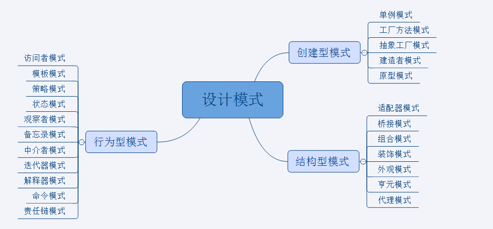

# 设计模式

## 什么是设计模式

设计模式（Design Pattern）是一套被反复使用、多数人知晓的、经过分类编目的、代码设计经验的总结。使用设计模式是为了可重用代码、让代码更容易被他人理解、保证代码可靠性。毫无疑问，设计模式于己于他人于系统都是多赢的，设计模式使代码编制真正工程化，设计模式是软件工程的基石，如同大厦的一块块砖石一样。项目中合理地运用设计模式可以完美地解决很多问题，每种模式在现在都有相应的原理与之对应，每一个模式描述了一个在我们周围不断重复发生的问题，以及该问题的核心解决方案，这也是它能被广泛应用的原因。

## 目录

创建型模式：

1. [单例模式](#单例模式)
1. [工厂方法模式](#工厂方法模式)
1. [抽象工厂模式](#抽象工厂模式)
1. [建造者模式](#建造者模式)
1. [原型模式](#原型模式)

结构型模式：

1. [适配器模式](#适配器模式)
1. [桥接模式](#桥接模式)
1. [组合模式](#组合模式)
1. [装饰器模式](#装饰器模式)
1. [外观模式](#外观模式)
1. [享元模式](#享元模式)
1. [代理模式](#代理模式)

行为型模式：

1. [访问者模式](#访问者模式)
1. [模板模式](#模板模式)
1. [策略模式](#策略模式)
1. [状态模式](#状态模式)
1. [观察者模式](#观察者模式)
1. [备忘录模式](#备忘录模式)
1. [中介者模式](#中介者模式)
1. [迭代器模式](#迭代器模式)
1. [解释器模式](#解释器模式)
1. [命令模式](#命令模式)
1. [责任链模式](#责任链模式)

总结：

1. [总结](#总结)

## 单例模式

单例模式保证了一个类只有一个实例，并提供一个访问它的全局访问点。

**何时使用：**

想控制实例数目，节省系统资源

**应用实例：**

1. 一个党只能有一个主席
1. Windows 是多进程多线程的，在操作一个文件的时候，就不可避免地出现多个进程或线程同时操作一个文件的现象，所以所有文件的处理必须通过唯一的实例来进行
1. 一些设备管理器常常设计为单例模式，比如一个电脑有两台打印机，在输出的时候就要处理不能两台打印机打印同一个文件

**优点：**

1. 在内存里只有一个实例，减少了内存开销，尤其是频繁的创建和销毁实例
1. 避免对资源的多重占用

**缺点：**

没有接口，不能继承，与单一职责原则冲突，一个类应该只关心内部逻辑，而不关心外面怎么样来实例化

## 工厂方法模式

工厂方法模式定义了一个创建对象的接口，但由子类决定要实例化的类是哪一个，也就是说工厂方法模式让实例化推迟到子类。

**何时使用：**

我们明确地计划不同条件下创建不同实例时

**应用示例：**

1. 您需要一辆汽车，可以直接从工厂里面提货，而不用去管汽车是怎么做出来的，以及这个汽车里面的具体实现
1. Hibernate 换数据库只需要换方言和驱动就可以

**优点：**

1. 一个调用者想创建一个对象，只需要知道其名称就可以了
1. 扩展性高，如果想增加一个产品，只需要扩展一个工厂类就可以
1. 屏蔽产品的具体实现，调用者只关心产品的接口

**缺点：**

1. 每次增加一个产品时，都需要增加一个具体的类和对象实现工厂，使得系统中类的个数成倍增加，在一定程度上增加了系统的复杂度，同时也增加了系统具体类的依赖

## 抽象工厂模式

抽象工厂模式提供了一个创建一系列相关或者互相依赖的对象的接口，而无需指定它们具体的类。

**何时使用：**

系统的产品有多于一个的产品族，而系统只消费其中某一族的产品

**应用实例：**

工作了，为了参加一些聚会，肯定有两套或多套衣服吧，比如说有商务装（成套，一系列具体产品）、时尚装（成套，一系列具体产品），甚至对于一个家庭来说，可能有商务女装、商务男装、时尚女装、时尚男装，这些也都是成套的，即一系列具体产品。假设一种情况（现实中是不存在的，要不然，没法进入共产主义了，但有利于说明抽象工厂模式），在您的家中，某一个衣柜（具体工厂）只能存放某一种这样的衣服（成套，一系列具体产品），每次拿这种成套的衣服时也自然要从这个衣柜中取出了。用 OO 的思想去理解，所有的衣柜（具体工厂）都是衣柜类的（抽象工厂）某一个，而每一件成套的衣服又包括具体的上衣（某一具体产品），裤子（某一具体产品），这些具体的上衣其实也都是上衣（抽象产品），具体的裤子也都是裤子（另一个抽象产品）。

**优点：**

当一个产品族中的多个对象被设计成一起工作时，它能保证客户端始终只使用同一个产品族中的对象

**缺点：**

产品族扩展十分困难，要增加一个一个系列的某一个产品，既要在抽象的 Creator 里加代码，也要在具体的实现里加代码

## 建造者模式

将一个复杂的构建过程与其表示相分离，使得同样的构建过程可以构建不同的表示。

**何时使用：**

一些基本部件不会变，而其组合经常变化的时候

**应用实例：**

1. 去肯德基，汉堡、可乐、薯条、炸鸡翅等是不变的，而其组合是经常变化的
1. Java 中的 StringBuilder

**优点：**

1. 建造者独立，易于扩展
1. 便于控制细节风险

**缺点：**

1. 产品必须有共同点，范围有限制
1. 如内部变化复杂，会有很多的建造类

## 原型模式

在我们应用程序可能有某些对象的结构比较复杂，但是我们又需要频繁的使用它们，如果这个时候我们来不断的新建这个对象势必会大大损耗系统内存的，这个时候我们需要使用原型模式来对这个结构复杂又要频繁使用的对象进行克隆。所以原型模式就是用原型实例指定创建对象的种类，并且通过复制这些原型创建新的对象。

**何时使用：**

1. 当一个系统应该独立于它的产品创建、构成和表示时
1. 当要实例化的类是在运行时刻指定时，例如，通过动态装载
1. 为了避免创建一个与产品类层次平行的工厂类层次时
1. 当一个类的实例只能有几个不同状态组合中的一种时，建立相应的原型并克隆他们可能比每次用合适的状态手工实例化该类更方便

**应用实例：**

1. 细胞分裂
1. Java 中的 `Object.clone()` 方法

**优点：**

1. 性能提高
1. 逃避构造函数的约束

**缺点：**

1. 配备克隆方法需要对类的功能进行通盘考虑，这对全新的类不是很难，但对已有的类不一定很容易，特别当一个类引用不支持串行化的简介对象，或者引用含有循环结构的时候
1. 必须实现 Cloneable 接口

## 适配器模式

在我们的应用程序中我们可能**需要将两个不同接口的类来进行通信**，在不修改这两个的前提下我们可能会需要某个**中间件**来完成这个衔接的过程。这个中间件就是适配器。所谓适配器模式就是将一个类的接口，转换成客户期望的另一个接口。它可以让原本两个不兼容的接口能够无缝完成对接。

作为中间件的适配器将目标类和适配者解耦，增加了类的透明性和可复用性。

**何时使用：**

1. 系统需要使用现有的类，而此类的接口不符合系统的需要
1. 想要建立一个可以重复使用的类，用于与一些彼此之间没有太大关联的一些类，包括一些可能在将来引进的类一起工作，这些源类不一定有一致的接口
1. 通过接口转换，将一个类插入另一个类系中

**应用实例：**

1. 美国电器 110V，中国 220V，就要有一个适配器将 110V 转化为 220V
1. 在 Linux 运行 Windows 程序需要 Wine
1. Java 中的 jdbc

**优点：**

1. 可以让任何两个没有关联的类一起运行
1. 提高了类的复用
1. 增加了类的透明度
1. 灵活性好

**缺点：**

1. 过多地使用适配器，会让系统非常凌乱
1. 由于 Java 至多继承一个类，所以至多只能适配一个适配者类，而且目标类必须是抽象类

## 桥接模式

如果说某个系统能够从多个角度来分类，且每一种分类都可能会变化，那么我们需要做的就是将这多个角度分离出来，使得他们能独立变化，减少他们之间的耦合，这个分离的过程就用到了桥接模式。

**何时使用：**

1. 实现系统可能有多个角度分类，每一种角度都可能变化

**应用实例：**

1. 墙上的开关，可以看到的开关是抽象的，而不用管里面是怎么实现的

**优点：**

1. 抽象和实现的分离
1. 优秀的扩展能力
1. 实现细节对客户透明

**缺点：**

1. 桥接模式的引入会增加系统的理解和设计难度，由于聚合关联关系建立在抽象层，要求开发者针对抽象层进行设计与编程

## 组合模式

组合模式组合多个对象形成树形结构以表示“整体-部分”的结构层次。组合模式使得用户对单个对象和组合对象的使用具有一致性。

**何时使用：**

1. 想表示对象的部分-整体层次结构（树形结构）
1. 希望用户忽略组合对象与单个对象的不同，用户将统一地使用组合结构中的所有对象

**应用实例：**

1. 算术表达式包括操作数、操作符和另一个操作数，其中另一个操作符也可以是操作数、操作符和另一个操作数
1. 在 Java AWT 和 Swing 中，对于 Button 和 Checkbox 是树叶，Container 是树枝

**优点：**

1. 高层模块调用简单
1. 节点自由增加

**缺点：**

在使用组合模式时，其叶子和树枝的声明都是实现类，而不是接口，违反了依赖倒置原则

## 装饰器模式

我们可以通过继承和组合的方式给一个对象添加行为，虽然使用继承能够很好拥有父类的行为，但是它存在几个缺陷：

1. 对象之间的关系复杂的话，系统变得复杂不利于维护
1. 容易产生“类爆炸”现象
1. 是静态的

我们使用装饰器模式来动态的给一个对象添加一些额外的职责，就增加功能来说，装饰器模式相比生成子类更灵活。

**何时使用：**

1. 在不想增加很多子类的情况下扩展类

**应用实例：**

1. 不论一幅画有没有画框，都可以挂在墙上。但是通常都是有画框的，并且实际上是画框被挂在墙上。在被挂在墙上之前，画可以被蒙上玻璃，撞到框子里

**优点：**

1. 装饰类和被装饰类可以独立发展，不会相互耦合，装饰器模式是继承的一个替代模式，装饰器模式可以动态扩展一个实现类的功能

**缺点：**

1. 多层装饰比较复杂

## 外观模式

为子系统中的一组接口提供一个一致的界面，外观模式定义了一个高层接口，这个接口使得这一子系统更加容易使用。

**何时使用：**

1. 客户端不需要知道系统内部的复杂联系，整个系统只需要提供一个接待员即可
1. 定义系统的入口

**应用实例：**

1. 去医院看病，可能要去挂号、门诊、划价、取药，让患者或者家属觉得很复杂，如果有提供接待人员，只让接待人员处理，就很方便
1. Java 的三层开发模式
1. 电脑启动：按电源键，自动启动CPU，自动启动内存，自动启动硬盘

**优点：**

1. 减少系统相互依赖
1. 提高灵活性
1. 提高了安全性

**缺点：**

1. 不符合开闭原则，如果要改东西很麻烦，继承重写都不合适

## 享元模式

运用共享技术有效地支持大量细粒度的对象

**何时使用：**

1. 系统中有大量对象
1. 这些对象消耗大量内存
1. 这些对象的状态大部分可以外部化
1. 这些对象可以按内蕴状态分为很多组，当把外蕴对象从对象中剔除出来时，每一组对象都可以用一个对象来代替
1. 系统不依赖于这些对象的身份，这些对象是不可辨的

**应用实例：**

1. Java 中的 String，如果有则返回，如果没有则创建一个字符串保存在字符串缓存池里面
1. 数据库的数据池

**优点：**

1. 大大减少了对象的创建，降低系统的内存，使效率提高

**缺点：**

1. 提高了系统的复杂度，需要分离出外部状态和内部状态，而且外部状态也具有固化的性质，不应该随着内部状态的变化而变化，否则会造成系统混乱

## 代理模式

代理模式就是给一个对象提供一个代理，并由代理对象控制对原对象的引用。它使得客户不能直接与真正目标对象通信。代理对象是目标对象的代表，其他需要与这个目标对象打交道的操作都是和这个代理对象在交涉。

**何时使用：**

1. 想在访问一个类时做一些控制

**应用实例：**

1. Windows 里面的快捷方式
1. 在代售点买火车票
1. Spring AOP

**优点：**

1. 职责清晰
1. 高扩展性
1. 智能化

**缺点：**

1. 由于在客户端和真实对象之间增加了代理对象，因此有些类型的代理模式可能造成请求处理速度变慢
1. 实现代理模式需要额外的工作，有些代理模式实现起来非常复杂

## 访问者模式

主要将数据结构与数据操作相分离。

**何时使用：**

1. 需要对一个对象结构中的对象进行很多不同的并且不相关的操作，而需要避免让这些操作“污染”这些对象的类，使用访问者模式将这些封装到类中

**应用实例：**

1. 你在朋友家做客，你是访问者，朋友接收你的访问，你通过朋友的描述，然后对朋友的描述做一个判断，这就是访问者模式

**优点：**

1. 符合单一指责原则
1. 优秀的扩展性
1. 灵活性

**缺点：**

1. 具体元素对访问者公布细节，违反了迪米特原则
1. 具体元素变更比较困难
1. 违反了依赖倒置原则，依赖了具体类，没有依赖抽象

## 模板模式

定义一个操作中的算法的骨架，而将一些步骤延迟到子类中。模板方法使得子类可以不改变一个算法的结构即可重定义该算法的某些特定步骤

**何时使用：**

1. 有一些通用的方法

**应用实例：**

1. 造房子的时候，地基、走线、水管都一样，只有在建筑后期才有加壁橱加栅栏等差异
1. Spring 中对 Hibernate 的支持，将一些已经定义好的方法封装起来，比如开启事务、获取 Session、关闭 Session 等

**优点：**

1. 封装不可变部分，扩展可变部分
1. 提取公共代码，便于维护
1. 行为由父类控制，子类实现

**缺点：**

1. 每一个不同的实现都需要一个子类来实现，导致类的个数增加，使得系统变得庞大

## 策略模式

定义一系列算法，把它们一个一个封装起来，并且使他们可相互替换。

**何时使用：**

1. 一个系统中有许多许多类，而区分它们的只是他们直接的行为

**应用实例：**

1. 诸葛亮的锦囊妙计，一个锦囊就是一个策略
1. 旅行的出游方式，选择骑自行车、坐汽车，每一种方式就是一种策略
1. Java AWT 的 LayoutManager

**优点：**

1. 算法可以自由切换
1. 避免使用多重条件判断
1. 扩展性良好

**缺点：**

1. 策略类会增多
1. 所有策略类都需要对外暴露

## 状态模式

允许对象在内部状态发生改变时改变它的行为，对象看起来好像修改了它的类。

**何时使用：**

1. 代码中包含大量与对象状态相关的条件语句

**应用实例：**

1. 打篮球的时候运动员可以有正常状态、不正常状态和超常状态

**优点：**

1. 封装了转换规则
1. 枚举可能的状态，在枚举状态之前需要确定状态种类
1. 将所有与某个状态有关的行为放到一个类中，并且可以方便的增加新的状态，只需要改变对象状态即可改变对象的行为
1. 允许状态转换逻辑与状态对象合成一体，而不是某一个巨大的条件语句块
1. 可以让多个环境共享一个状态对象，从而减少系统中对象的个数

**缺点：**

1. 状态模式的使用必然会增加系统中类和对象的个数
1. 状态模式的结构与实现都较为复杂，如果使用不当将导致程序结构和代码的混乱

## 观察者模式

定义对象间的一种一对多的依赖关系，当一个对象发生改变时，所有依赖于它的对象都得到通知并被自动更新。

**何时使用：**

1. 一个对象的状态发生改变，所有的依赖对象都将得到通知，进行广播通知

**应用实例：**

1. 拍卖时，拍卖师观察最高标价，然后通知给其他竞价者竞价

**优点：**

1. 观察者和被观察者是抽象耦合的
1. 建立一套触发机制

**缺点：**

1. 如果一个被观察者对象有很多的直接和简接的观察者的话，将所有的观察者都通知会花费很多时间
1. 如果在观察者和观察目标之间有循环依赖的话，观察目标会触发他们之间进行循环调用，可能导致系统崩溃
1. 观察者模式没有相应的机制让观察者知道所观察的对象是怎么发生变化的，而仅仅是知道目标对象发生了变化

## 备忘录模式

在不破坏封装性的前提下，捕获一个对象的内部状态，并在该对象之外保存这个状态

**何时使用：**

1. 很多时候我们总是需要记录一个对象的内部状态，这样做的目的是为了允许用户取消不确定或者错误的操作，能够恢复到他原先的条件，使得他有后悔药可吃

**应用实例：**

1. 后悔药
1. 打游戏时的存档
1. Windows 里的 ctrl+z
1. IE 中的后退

**优点：**

1. 给用户提供了一种可以恢复状态的机制，可以使用户能够比较方便地回到某个历史的状态
1. 实现了信息的封装，使得用户不需要关心状态的保存细节

**缺点：**

1. 消耗资源。如果类的成员变量过多，势必会占用比较大的资源，而且每一次保存都会消耗一定的内存

## 中介者模式

用一个中介对象来封装一系列的对象交互，中介者使各对象不需要显式地相互引用，从而使其耦合松散，而且可以独立地改变它们之间的交互

**何时使用：**

1. 多个类相互耦合，形成了网状结构

**应用实例：**

1. 机场调度系统
1. MVC框架，其中 Controller 是 Model 和 View 的中介者

**优点：**

1. 降低了类的复杂度，将一对多转换成了一对一
1. 各个类之间解耦
1. 符合迪米特原则

**缺点：**

1. 中介者会庞大，变得复杂难以维护

## 迭代器模式

提供一种方法顺序访问一个聚合对象中的各个元素，而又无需暴露该对象的内部表示

**何时使用：**

1. 遍历一个聚合对象

**应用实例：**

1. Java 中的 Iterator

**优点：**

1. 支持以不同的方式遍历聚合对象
1. 迭代器简化了聚合类
1. 在同一个聚合上可以有多个遍历
1. 在迭代器模式中，增加新的聚合类和迭代器类都很方便，无需修改原有代码

**缺点：**

由于迭代器模式将存储数据和遍历数据的职责分离，增加新的聚合类需要对应增加新的迭代器类，类的个数成对增加，一定程度上增加了系统的复杂性

## 解释器模式
## 命令模式
## 责任链模式

## 总结
